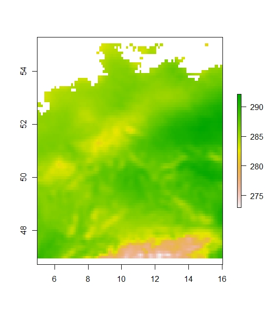
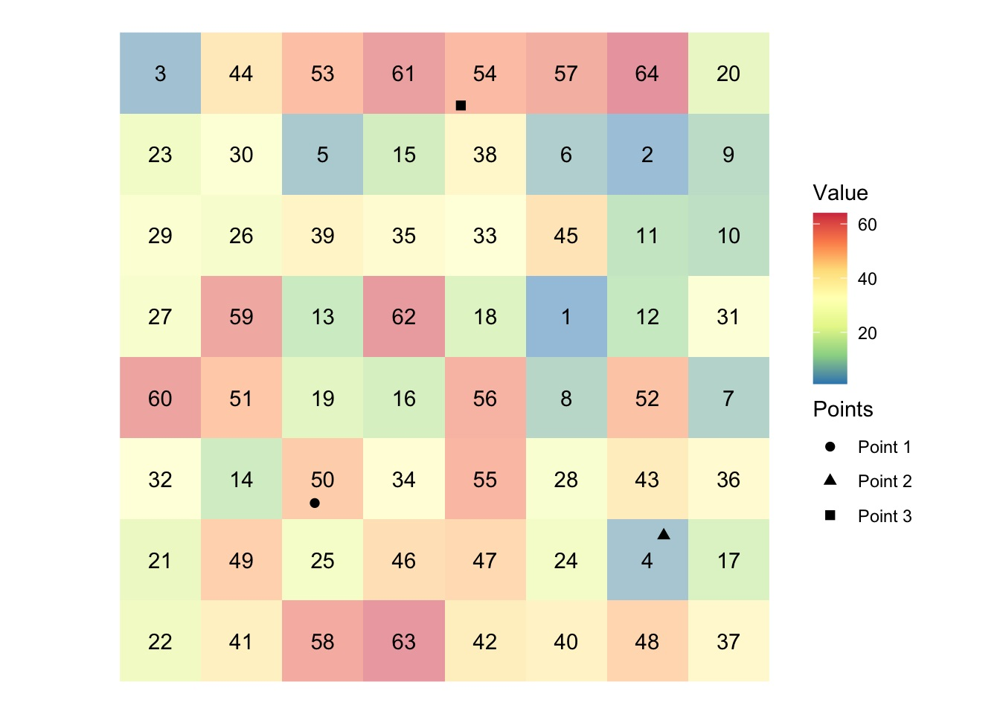
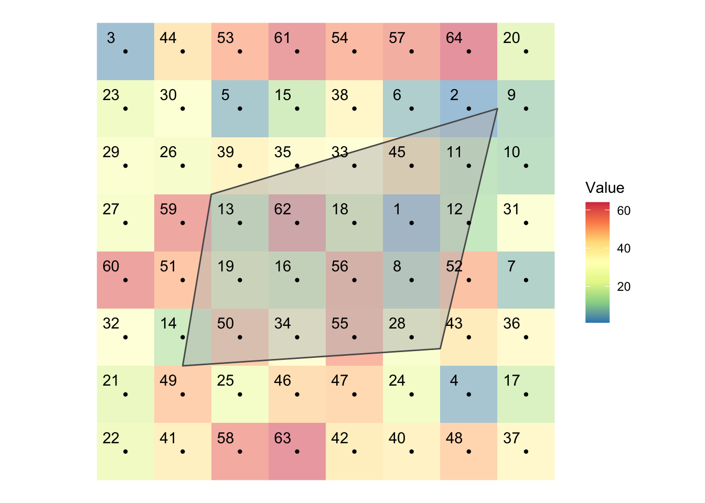

```{r, message = FALSE, include = FALSE}

# load required packages 
if (!require("pacman")) install.packages("pacman")
pacman::p_load(
  terra, # handle raster data
  raster, # handle raster data
  ncdf4, # handle raster data
  exactextractr, # fast extractions
  sf, # vector data operations
  dplyr, # data wrangling
  tidyr, # data wrangling
  data.table, # data wrangling
  tictoc, # timing codes
  tmap, # for mapping
  xlsx, # for export
  foreign, # for export
  haven, # export .dta
  knitr, # knitting R notebooks
  rprojroot, # knitting R notebooks
  weed, # handling EM-DAT extract
  openxlsx, # opening .xlsx files
  ggmap, # geocoding
  ggplot2
  )  


 rm(list=ls())
```


```{r setup, include=FALSE}
# set the working directory to the base directory of the project
knitr::opts_knit$set(root.dir = rprojroot::find_rstudio_root_file())
```


## 1. Introduction
In recent years, more and more geo-gridded and remotely sensed data has become publicly available for research purposes. In empirical research in the social sciences, there has been a growing interest to leverage this data. In regression analyses, the unit of observation often is e. g. the household, or the sub-district. For some research questions, geo-coded information on the level of these observational units is desirable. Obviously one could think of a whole range of indicators that could be extracted for geographical regions or points of interest: temperature, rainfall, snowfall, night light intensity, indices like the NDVI, or data for calculating the SPEI index. In the first part of this session, we want to introduce you to some basics of geo-data and enable you to extract geo-coded data for pre-defined geographical units. 
 

## 1.1 What is a spatial vector dataset?
A spatial vector dataset is a datafile that contains information on geometric features. There are plenty of geometric features one could think of: 
E.g. a city, a river, a administrative region or district.

Common geometric features represented in datasets include:

* __POINT:__ vector of two values,  area-less feature (e.g., mine, city ,...)

* __LINESTRING:__ sequence of points that represent a line when being connected (e.g., a tributary of a river)
```{r}
# collection of points in a matrix form
s1 <- rbind(c(1, 1), c(5, 4), c(2, 5), c(3, 5))

s1

# create a "LINESTRING"
a_linestring <- st_linestring(s1)

# plot linestring
plot(a_linestring)
```


* __POLYGON__: sequence of points that form a geometry with a positive area when being connected (e.g., county, state, country). To do that, first and last point are identical.
```{r}
# collection of points in a matrix form 
p1 <- rbind(c(0, 0), c(4, 0), c(4, 4), c(0, 4), c(0, 0))

# see what s1 looks like 
p1

# create a polygon
a_polygon <- st_polygon(list(p1))

# plot polygon
plot(a_polygon)


```


### What is a shapefile?

A shapefile is a file that contains a collection of polygones. 
A shapefile essentially is a regular `data.frame` with a number of variables containing information except that you have a variable called `geometry` at the end. In R, shapefiles can be imported as simple feature objects using the `sf` package.

Each row represents a single geographic unit (polygon). In the example: Länder, Landkreise, Gemeinden in Germany.
```{r}
# load shapefiles
states_shp = read_sf("data/shapefiles/Germany/gadm41_DEU_1.shp")
counties_shp = read_sf("data/shapefiles/Germany/gadm41_DEU_2.shp")

head(states_shp)
head(counties_shp)
```

Shapefiles can be visualized using the `plot()` function:
```{r}
# visualize polygons
plot(states_shp, max.plot = 1)
plot(counties_shp, max.plot = 1)
```

Polygons in the shapefiles can also be accessed individually using the function `st_geometry()`:
```{r}
# plot individual polygon from shapefile
plot(st_geometry(states_shp[1, ]))
```


### Where to find shapefiles online?

National statistical offices typically provide shapefiles for various administrative levels. Some valuable online resources for downloading shapefiles include:

* __International Shapefiles:__ https://gadm.org/download_country.html

* __EU Shapefiles:__ https://ec.europa.eu/eurostat/de/web/gisco/geodata/reference-data/administrative-units-statistical-units/nuts#nuts21

### Task 1

Download a shapefile for a country of your choice from gadm.org. Using the `sf` package, import the shapefile to R and plot it for level-1 administrative units. Note: Use the .shp for import to R. All other associated files (.cpg, .dbf, .prj, .shx), however, must be present in the same directory as the .shp file.

## 1.2 What is a spatial raster dataset?

Raster data files are constituted by grids (cells) and each grid normally holds one value. 
For geo-gridded remotely sensed data (satellite data), each cell refers to one pixel in the picture. 






Three important features that are stored in a raster data file:  

* __Resolution:__ Information in raster data file is stored on a certain resolution. One grid (pixel) may have the resolution 500X500m or 2kmx2km etc.

* __Projection:__ coordinate reference system (CRS) is stored in a raster data file  

* __Spatial extent:__ In accordance to the coordinate system, the spatial extent of the geographical area covered is stored in the raster data file 

There are quite some different formats for raster data. These include: GeoTiff, SAGA, ENVI, netCDF. Oftentimes a format can be chosen when data is downloaded from the internet.


#### What is a netCDF file?
netCDF is a powerful and frequently used format to store spatial raster data. netCDF files contain a two-dimensional spatial grid (longitude, latitude) and a third dimension (e.g. date, time). Weather data measured over a constant grid over time is normally stored in NetCDF format.
With this, it is possible to store a lot of information in one file. Exemplary, for the same spatial extent and resolution many individual “layers” (pictures) of different “indicators” (temperature, snowfall, etc.) can be contained in one file.

Raster data can be handled in R with ´terra´ or ´raster´ packages. 

In the ´raster´ package there are three options to import data: 

* __RasterLayer:__ Only allows for single-layer raster data. One layer means one picture.
* __RasterStack:__ Can be formed from separate raster files containing one or more layers.
* __RasterBrick:__ Can be formed only from a single (multi-layer) raster file.

Let´s import a multi-layer raster data file using the function `raster::brick()`:
```{r}
# load netCDF file (2m temperature, world) to R:
temp_world <- raster::brick("data/era5/era5_temp_2m_may_jul_1day_2022_world.nc")

# check characteristics of loaded netCDF file:
temp_world
```
As we can see the netCDF file contains the above mentioned information: 

* __Dimension:__ The file contains 6,483,600 cells (pixels), and 3 layers (images/ days).
* __Resolution:__ 0.1 x 0.1 This is equivalent to a native resolution of 9 km.
* __Projection:__ Indicated by CRS - geo-projection is WGS84
* __Extent:__ Information on geographical extent covered in the data file (in accordance to crs).


Let´s visualize the content of the netCDF file using the `plot()` function:

```{r}
# visualize netCDF file in R:
plot (temp_world) 

```

### Where to find raster files online?

Geo-gridded data is available for a wide range of indicators (land cover, elevation, night light, weather). When it comes to weather data, remotely sensed data and reanalysis can be downloaded from free satellite and GIS imagery sources.

* __Climatic data from the USA:__ Daily high-spatial resolution (~4 x 4km) surface meteorological data covering the contiguous US from 1979. https://www.climatologylab.org/gridmet.html

* __USGS Earth Explorer:__ Large database for primary satellite data from e.g. the Landsat satellite. https://earthexplorer.usgs.gov/

* __Climate Data Store Copernicus:__ EU funded project for climate data. Common resource for weather data in research. https://cds.climate.copernicus.eu/#!/home 
  + ERA5-Land hourly: Reanalysis combines model data with observations from across the world into a globally complete and consistent dataset. Temporal coverage from January 1950 to present. Many variables including temperature, precipitation / snowfall, vegetation. https://cds.climate.copernicus.eu/cdsapp#!/dataset/reanalysis-era5-land?tab=overview
  
  
### Using an API to download raster data from Copernicus Data Store

As shown, we can use the Copernicus Data Store for manually downloading netCDF files for the indicators needed. A much more convinient way is to use an API. In the following the set up of the API is sketched. A detailed tutorial explaining how to set up API can also be found here: https://github.com/bluegreen-labs/ecmwfr

```{r, message = FALSE}
# load required packages 
# library(ecmwfr)
# library(rgdal)
# library(ncdf4)
# library(raster)

# specify copernicus credentials under XXX, and YYY credentials can be found in copernicus account online
# cds.key <- "XXX"
# wf_set_key(user = "YYy", key = cds.key, service = "cds")

# specify download request
# variable describes the desired band of the era5 data, check here for names (https://cds.climate.copernicus.eu/cdsapp#!/dataset/reanalysis-era5-land?tab=overview)
# time is set to midnight in this case 
# target describes the name of the downloaded file 
# area are coordinates describing the area of interest (in this case Mongolia)

# request <- list(
#   dataset_short_name = "reanalysis-era5-single-levels",
#   product_type   = "reanalysis",
#   format = "netcdf",
#   variable = "2m_temperature",
#   date = "2020-01-15/2020-01-20",
#   time = c("12:00"),
#   # area is specified as N, W, S, E
#   area = c(52.2, 87.3, 41.5, 120.2),
#   target = "era5_temp_2m_jan_5days_2020.nc"
# )

# request a transfer to computer. if this is not specified, file will be available for download in the copernicus store. 
# file <- wf_request(user = "YYY",
#                    request = request,
#                    transfer = TRUE,
#                    path = "C:/Users/XYZ")

```


## 2. Spatial interactions of vector and raster datasets  
In the first part of this session we learned about two different types of spatial datasets: vector and raster datasets. In empirical social sciences, our observation units are almost always points (e.g., location of farms/ households/ cities/ wells) or polygons (e.g., districts, provinces). For conducting analyses such as regressions, we oftentimes may want to associate those units with their according values held in raster datasets (e.g., temperature, precipitation, night light intensity, ...). In the following, we will undertake a small extraction exercise. Our aim is to spatially interact vector and raster datasets. 




## 2.1 Pre-conditions for spatial interaction
### Assuring identical geographical projection of raster and vector datasets
A first pre-condition for spatial joints is that both, or vector and raster data set have the same geographical projection. We can check this using the `terra::crs()` function:

```{r}
# check coordinate system of raster and vector files: 
terra::crs(temp_world)
terra::crs(counties_shp)
```

Under ID you find the identifier defined by the European Petroleum Survey Group (EPSG) for the WGS 84 projection namely being 4326. All 4-digit EPSG identifiers can be accessed here: https://spatialreference.org/ref/epsg/?search=WGS84&srtext=Search
If projections of your vector and raster data do not align, a transformation of the projection of your vector data can be undertaken by the `st_transform()` function. The first argument should be the vector data object you are transforming and the second being the EPSG number of the new CRS.

```{r}
# check coordinate system of raster and vector files: 
counties_2 <- st_transform(counties_shp, 4267)
# check new coordinate system of vector files: 
terra::crs(counties_2)
# successfully transformed to NAD_27 projection
rm(counties_2)
```

### Crop raster data to extent of vector dataset
As a second step it may make sense to crop a raster layer to the geographical area of interest covered by the shapefile. With this, we can get rid of unnecessary parts of the raster dataset. Obviously, it is faster to extract values from a raster layer when the size of the raster dataset is smaller. Cropping raster raster layers can be done by using `terra::crop()`:

```{r}
# crop raster file to extent of vector dataset:
temp_ger <- terra::crop(temp_world, counties_shp)
# visualize cropped raster file:
plot (temp_ger) 

```


### Task 2
Use the raster dataset provided (name:__era5_temp_2m_may_jul_1day_2022_world.nc__) and load it to R using either the `terra` or `raster` package. Visualize the netCDF file using the `plot()` function and crop the raster dataset to the spatial extent of your shapefile uploaded in task 1.


## 2.2 Extracting values from raster data for polygons

In more technical terms, extracting values from raster for polygons means that for each polygon in our shapefile, we want to identify all raster cells that intersect with the area described by the polygon. We then want to assign a vector of all cell values to the polygon and extract spatial statistics for each polygon (such as the minimum/ maximum/ average value of the indicator). Once again the useful illustration from above: 


It is visible that some cells are completely covered by the polygon, while others are only partially lying within the polygon. In R there are different functions to extract values from a raster dataset. We will use the `exact_extract()` function as it allows to extract values from partially covered cells. An alternative is constituted by the `terra:extract()` function.

The `terra:extract()` functions  identifies i) all raster cells whose center lie inside the polygon, ii) assigns a vector of values of the cells to the polygon and iii) provides a coverage fraction value for each of the cell-polygon intersections. In the function, the first argument should be the raster dataset and the second should be the shapefile: 

```{r, results = 'hide', echo = TRUE}
# extract values from raster file to polygons:
temp_by_county <- exact_extract(temp_ger, counties_shp)
```

```{r}
# check head first element:
temp_by_county[1] %>% lapply(function(x) head(x))

# check head second element:
temp_by_county[2] %>% lapply(function(x) head(x))
```

The resulting object is a list of `data.frames` where ith element of the list is for the ith polygon of the `sf` object (shapefile). For each layer (day) and polygon there are multiple entries (temperature in Kelvin) for intersecting raster cells. The coverage_fraction function returns a `RasterLayer` with values from 0 to 1 indicating the fraction of each cell that is covered by the polygon.

Our aim is to arrive at a single temperature value (min, max, average) for each polygon and day. Multiple data frames are not easy to process/ export. To get closer to our aim, we convert the list of `data.frames` into a single `data.frame` using the `dplyr::bind_rows()` function in the next step. Note: We use the `.id` option to create a new identifier column that links each row to its original data.  

```{r}
# convert data.frames to one data.frame:
temp_by_county_2 <- bind_rows(temp_by_county, .id = "id") %>% 
  as_tibble()

head(temp_by_county_2, 10)
```

We now have a single `data.frame` with five columns containing information on the polygon ID, the temperature values on the three observed days, and the coverage fraction. We still have multiple rows (cell values) for each polygon. To get one value for each polygon, we need to reduce the  many raster cells in one polygon to one value (for each day). 
As it is difficult to collapse rows (especially if we have a multitude of columns (days)), we reshape to long using the `dplyr::pivot_longer`. Note the polygon ID should be kept as column:

```{r}
# convert data.frames to one data.frame:
temp_by_county_3 <- pivot_longer(
  temp_by_county_2, 
  -c(id, coverage_fraction), 
  names_to = "date",
  values_to = "temp"
)  

head(temp_by_county_3)
tail(temp_by_county_3)
```

We now have only four columns left. All days are in one column now. As before, we still have multiple rows (cell values) for each polygon. We reduce the multiple entries to ONE value for each polygon and day. There are multiple operations one could think of here. We could summarize the information to arrive at the maximum/ minimum meassured temperature, or the average meassured temperature in the polygon.  


```{r}
#  calculate coverage-weighted mean for each polygon and day:
#  note: transformation to Celsius is undertaken here 
temp_by_county_4 <- temp_by_county_3 %>% 
  group_by(id, date) %>% 
  summarize(temp = sum(temp * coverage_fraction) / sum(coverage_fraction) - 273.15)

head(temp_by_county_4)
```

The result is a `data.frame` with three columns containing one entry per polygon and day. The polygon id still refers to ith polygon in the `sf`(shapefile). In many cases we want to merge the information contained in the shapefile such as names or specific survey ids back to our table of extracted values. 

```{r}
# merge shapefile info back to table 
temp_by_county_5 <- temp_by_county_4 %>%  mutate(id = as.numeric(id))

#--- merge with shapefile ---#
temp_by_county_6 <-  counties_shp %>% 
  mutate(id := seq_len(nrow(.))) %>% 
  left_join(., temp_by_county_5, by = "id") 

head(temp_by_county_6)
```

The result is a `data.frame` with 17 columns containing both, the extracted temperature values as well as the variables from the shapefile. 

```{r}
# convert data.frames to one data.frame:
temp_by_county_7 <- pivot_wider(
  temp_by_county_6, 
  names_from = "date",
  values_from = "temp"
)  

head(temp_by_county_7)
tail(temp_by_county_7)
```

```{r}

#--- merge with shapefile ---#
temp_by_county_8 = st_as_sf(temp_by_county_7)

ggplot(data = temp_by_county_8) +
    geom_sf(aes(fill = X2022.05.01.12.00.00)) + ggtitle("Average temperature for German counties for May 1st, 2022, 12 pm") +
    scale_fill_viridis_c(option = "plasma", trans = "reverse")
```


### Task 3
Using the shapefile and the netCDF file uploaded earlier, undertake the above raster extraction for all polygons of your shapefile. Identify the maximum temperature value for each polygon and day contained in your datasets and return it as a single `data.frame`


## 3. Case Example: EM-DAT database
Finally, we sometimes may want to evaluate whether a region was affected by events of some kind (e.g., violent conflicts). Because public records for this kind of thing can be messy and inconsistent, we may need to create our own coordinate intersections (i.e., geocoding). Therefore, in this last section, we present a case example and show how to extract and geocode data on natural disasters from EM-DAT, the international disasters database.

For our example, we are going to look at natural disasters that occurred in Germany during the period 1995-2020 and use the `weed` package for handling the EM-DAT extract.

## 3.1 Clean the EM-DAT database extract

First, let's load the EM-DAT extract:
```{r, message = FALSE}
emdat_data = read_emdat("data/emdat_public_2022_12_11_query_uid-zbbmhD.xlsx")
head(emdat_data$disaster_data)
```

Information on the location of the disasters is given as a list of the affected regions. We first split disaster locations to create one column per disaster and location.

The EM-DAT extract contains information on a range of aspects related to the disaster events (total people affected, total damages, etc.). For our example, let's keep things simple and only choose a limited number of variables.
```{r}
emdat_df = as.data.frame(emdat_data$disaster_data) %>%
            subset(select = c("Dis No",
                              "Year",
                              "Disaster Subgroup",
                              "Country",
                              "Geo Locations")) %>%
            split_locations(column_name = "Geo Locations",
                  dummy_words = c("(Adm1)", "(Adm2)")) %>%
            filter(!(location_word == ".") &
                   !(location_word == "adm1") &
                   !(location_word == "adm2"))

head(emdat_df)
# remove emdat tibble
rm(emdat_data)
```

Remove points and trailing/leading white spaces in location names:
```{r}
for (i in nrow(emdat_df)){
  trimws(gsub("\\.", "", emdat_df$location_word[i]))
}
rm(i)
```

## 3.2 Geocoding disaster locations

Now that we have separated out the disaster locations, we are going to geocode them in order to assign them to the regions. There are a number of APIs available that can be used for geocoding locations. For this example, we are using the `geocode()` function provided by the `weed` package, which uses the GeoNames API. A GeoNames username is required to to make queries to the API. You can learn more about that at https://www.geonames.org/manual.html#account

```{r}
emdat_df = weed::geocode(emdat_df,
                         n_results = 1,
                         unwrap = TRUE,
                         geonames_username = "mariuslbraun")
```


Check the percentage of locations located:
```{r}
percent_located_locations(emdat_df,
                          lat_column = "lat1",
                          lng_column = "lng1",
                          plot_result = TRUE)
```


## 3.4 Assign disasters to regions using shapefile

Now that all disasters are geocoded, we can match them with the German federal states using an appropriate shapefile and the ``located_in_shapefile`` function. Let's first load the shapefile and create an empty column in our data frame to be filled with the name of the region the disaster location is located in:
```{r, results = 'hide', echo = TRUE, warning = FALSE}
# load shapefile
states_shp = read_sf('data/shapefiles/Germany/gadm41_DEU_1.shp')

# create empty column for regions
emdat_df$region = NA

# In knitting the notebook, the weed function located_in_shapefile causes an error even though it would not produce any errors when you are running on an R session. The solution used here is to create the object to be used and save it, and then read it.

# create placeholder column to evaluate whether location is located in polygons
# emdat_df = located_in_shapefile(emdat_df,
#                                lat_column = "lat1",
#                                lng_column = "lng1",
#                                shapefile = states_shp$geometry[1])
# emdat_df$in_shape = FALSE

# saveRDS(emdat_df, "data/emdat_df.rds")
emdat_df = readRDS("data/emdat_df.rds")

```

We now iterate over all polygons in our shapefile and all disasters in our data frame, each time checking if the disaster location is located in the given shapefile:
```{r}
# iterate over all polygons in shapefile
for (i in 1:nrow(states_shp)){
  # check if disaster was located in polygon
  emdat_df = located_in_shapefile(emdat_df,
                                  lat_column = "lat",
                                  lng_column = "lng",
                                  shapefile = states_shp$geometry[i])
  for(j in 1:nrow(emdat_df)){
    # if disaster j was located in region i, write name of region i to row j
    if(emdat_df$in_shape[j] == TRUE){
      emdat_df$region[j] = states_shp$NAME_1[i]
    }
  }
}
rm(i, j)
emdat_df = subset(emdat_df, select = -in_shape)

head(emdat_df)
```

The results don't look too bad. However, there is one major problem: Because information on disaster location in EM-DAT is sometimes given at more than one level of administrative unit (e.g., "Bayern" and "Oberbayern"), some disasters appear in our data frame more than once for the same region. This is an issue if we want to obtain the frequency at which a region was hit by disasters in a given time period.

To deal with this issue, we concatenate disaster IDs and region names to create a unique identifier of each disaster-region combination and then remove the duplicates:
```{r}
# remove double counts of disasters using concatenation of region name and 
# disaster ID
emdat_df$help = paste0(emdat_df$`Dis No`, emdat_df$region)
emdat_df = emdat_df %>% distinct(help, .keep_all = TRUE)
emdat_df = subset(emdat_df, select = -c(`Geo Locations`,
                                        uncertain_location_specificity,
                                        help))

head(emdat_df)
```

Finally, we use the data to create disaster counts for the German federal states and create a map:
```{r}
states_shp$disaster_count = NA
for(i in 1:nrow(states_shp)) {
  states_shp$disaster_count[i] = sum(emdat_df == states_shp$NAME_1[i])
}
rm(i)

ggplot(data = states_shp) +
    geom_sf(aes(fill = disaster_count)) + ggtitle("Disaster counts by federal state") +
    scale_fill_viridis_c(option = "plasma", trans = "reverse")
```

## Task 4

Use the EM-DAT extract for Vietnam for the period 1995-2020 "emdat_public_2022_12_12_query_uid-wnxkXV.xlsx" to create a province-level map of disaster counts for Vietnam.


### Useful resources:

This tutorial is heavily informed by the following online tutorials:

* Bivand, Roger (2018). Geocomputation with R. https://geocompr.robinlovelace.net/

* Pebesma,Edzer & Bivand, Roger (2022). Spatial Data Science with applications in R. https://r-spatial.org/book/

* Mieno, Taro (2022). R as GIS for Economists. https://tmieno2.github.io/R-as-GIS-for-Economists/index.html

* Sadler, Jesse (2018). Introduction to GIS with R. Spatial data with the sp and sf packages. https://www.jessesadler.com/post/gis-with-r-intro/
